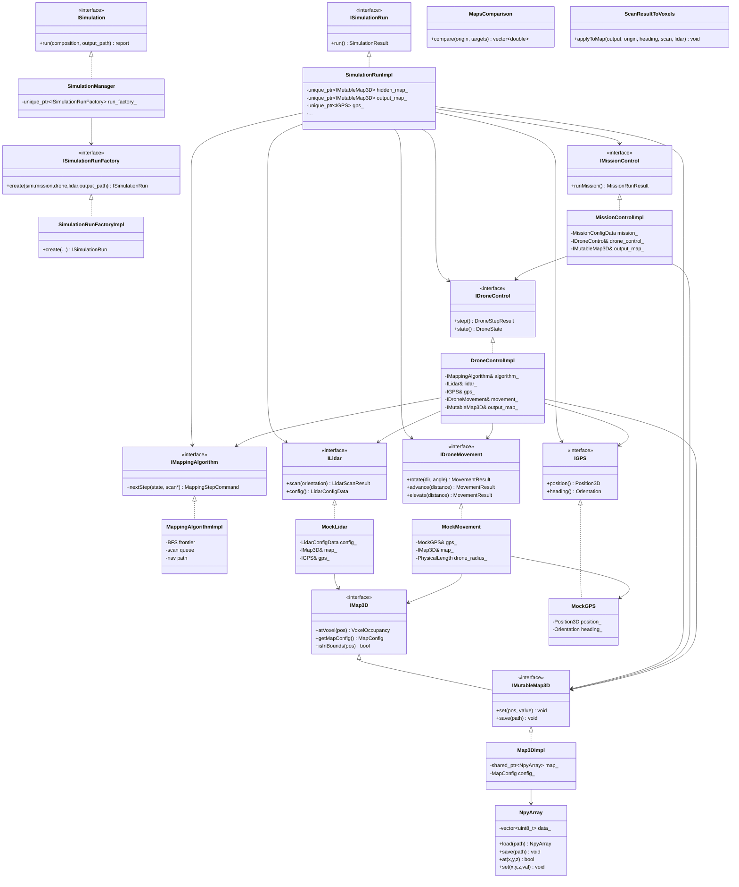
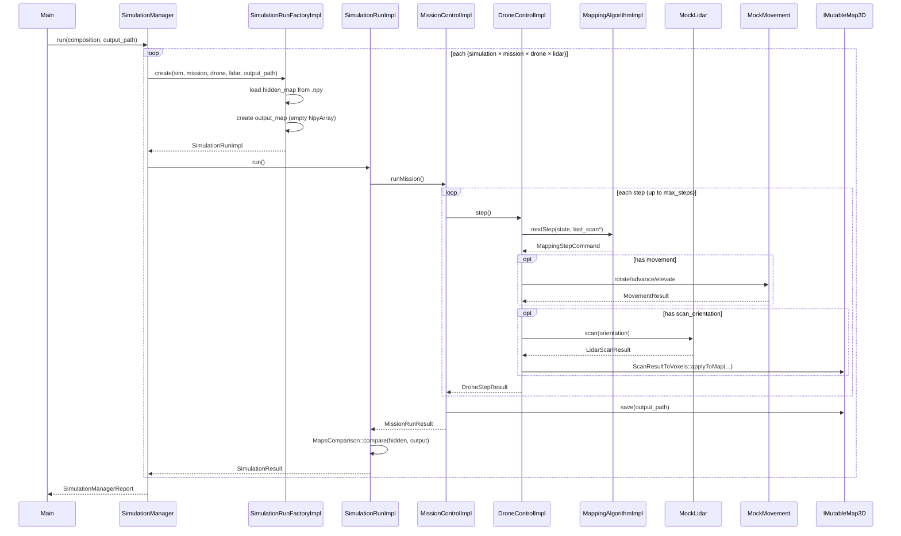

# High-Level Design – Assignment 2: Drone Mapper Simulation

## Architecture Overview

Assignment 2 refactors the drone mapping system into a fully decoupled, testable component hierarchy.
All components communicate through well-defined interfaces, with dependency injection enabling
independent testing of each component.

## Component Hierarchy

```
main()
  └── SimulationManager
        └── ISimulationRunFactory
              └── SimulationRunImpl (one per combination)
                    ├── IMissionControl (MissionControlImpl)
                    │     └── IDroneControl (DroneControlImpl)
                    │           ├── IMappingAlgorithm (MappingAlgorithmImpl)
                    │           ├── ILidar (MockLidar)
                    │           ├── IGPS (MockGPS)
                    │           └── IDroneMovement (MockMovement)
                    ├── IMap3D (hidden, Map3DImpl from .npy)
                    └── IMutableMap3D (output, Map3DImpl empty)
```

## Class Diagram



## Sequence Diagram – Simulation Run



## Design Decisions

### 1. Self-Contained NPY I/O (No TinyNPY Dependency)
We implement our own minimal `NpyArray` class that reads/writes the `.npy` format directly. This
eliminates an external dependency while remaining fully compatible with NumPy's output.

### 2. MockMovement Includes Collision Detection
Unlike the skeleton stub, `MockMovement::advance()` and `elevate()` check the hidden map for
obstacles along the path. This prevents the drone from flying through walls, which would make
the simulation physically invalid.

### 3. BFS Exploration Algorithm
`MappingAlgorithmImpl` uses a breadth-first exploration strategy:
1. **Initial scan**: at the starting position, emit 10 scan directions (8 horizontal + up/down)
2. **Queue neighbors**: after each scan, queue all unmapped adjacent voxels
3. **Navigate**: BFS pathfinding to the next frontier voxel
4. **Rescan**: on arrival at a new position, scan again
5. **Terminate**: when the frontier is exhausted (no reachable unmapped voxels)

### 4. ScanResultToVoxels (Provided Algorithm)
The `ScanResultToVoxels::applyToMap()` method (adapted from the course skeleton) converts LiDAR
hits into map occupancy states. It marks:
- Path before a hit as `Empty`
- Hit position as `Occupied`
- Near-field returns (<z_min) as `PotentiallyOccupied`

### 5. Map Comparison Algorithm
`MapsComparison::compare()` computes a score 0..100 based on:
- Voxel-wise agreement between the hidden map (reference) and the output map
- False positives (output says occupied, reference says empty) are penalized
- Score = `correct / (total + false_positives) * 100`

### 6. Error Handling
- `ErrorHandler` (singleton) immediately flushes all errors to `error_log.txt`
- Simulation continues after per-run errors (score = -1 for failed runs)
- Fatal configuration errors abort with a message to stderr

## File Structure

```
HW2_CPP/
├── CMakeLists.txt
├── README.md
├── HLD.md
├── include/drone_mapper/       ← All public headers (interfaces + implementations)
│   ├── types/                  ← Data type headers
│   ├── Units.h                 ← mp-units type aliases
│   ├── I*.h                    ← Interface headers
│   ├── *Impl.h                 ← Implementation headers
│   ├── Mock*.h                 ← Mock component headers
│   └── ...
├── src/                        ← Implementation (.cpp) + private helpers
│   ├── *Impl.cpp
│   ├── Mock*.cpp
│   ├── YamlParser.{h,cpp}
│   ├── ErrorHandler.{h,cpp}
│   ├── drone_mapper_simulation_main.cpp
│   └── maps_comparison_main.cpp
├── tests/
│   ├── components/             ← 7 component test files
│   └── integration/            ← 2 integration test files
└── inputs/
    ├── drone/                  ← Drone YAML configs
    ├── lidar/                  ← Lidar YAML configs
    ├── mission/                ← Mission YAML configs
    ├── simulation/             ← Simulation YAML configs
    ├── map/                    ← .npy map files + generator
    └── sim_compose.yaml        ← Simulation composition file
```
