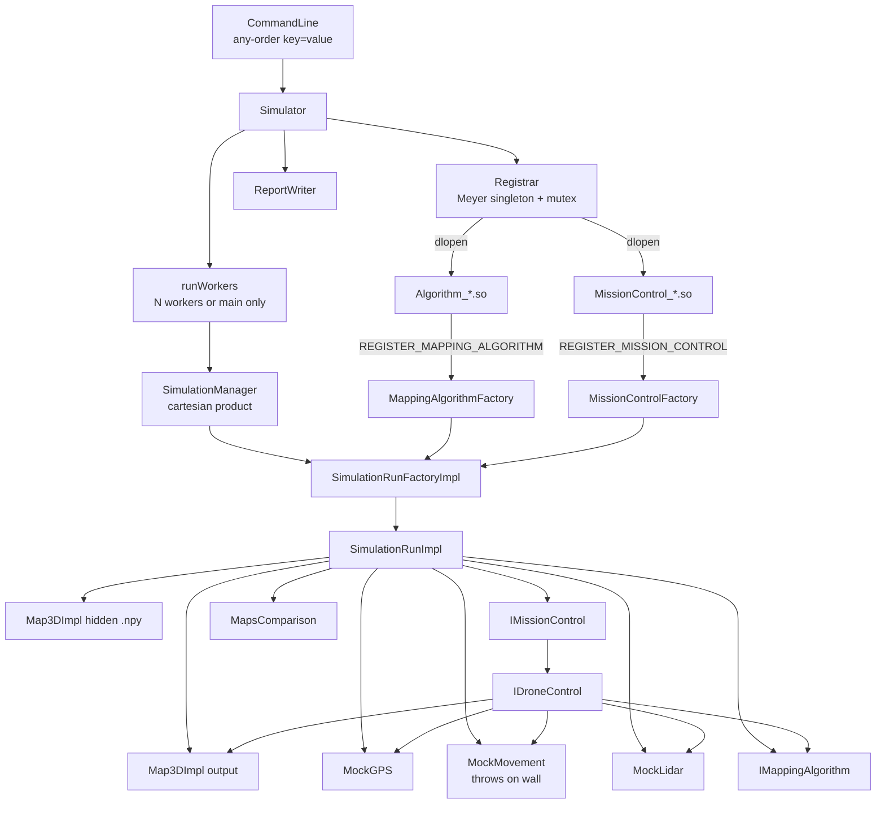

# Assignment 3 — Concurrent Drone Mapper (Plugin Host)

A C++20 simulator that loads **other teams’** mapping algorithms and mission-control implementations as shared libraries, runs them on a worker pool, and ranks the results.

This is the second stage of the pipeline in this repository. Assignment 2 (repository root) is a single executable that constructs our algorithm and mission control by name. Assignment 3 keeps the same mission physics and scoring, but the host **must not know the concrete classes**. The only contracts are staff-owned abstract interfaces plus two registration macros.

**Contributors:** Omar Abu Shah (213309941), Jameel Najjar (213727837)

| Artifact | Output | Namespace |
|---|---|---|
| `Simulator/` | `simulator_213309941_213727837` | `simulator` |
| `Algorithm/` | `Algorithm_213309941_213727837.so` | `algorithm_213309941_213727837` |
| `MissionControl/` | `MissionControl_213309941_213727837.so` | `mission_control_213309941_213727837` |
| `UserCommon/` | sources only (no makefile) | `user_common_213309941_213727837` |
| `common/` | staff headers, used as-is | `common` |

Staff-owned trees were not edited: `common/`, `Simulator/common_simulator/`, `MissionControl/common_mission_control/`.

A folder-by-folder implementation map is in [`docs/PROJECT3_IMPLEMENTATION.md`](docs/PROJECT3_IMPLEMENTATION.md).

---

## What problem this solves

Staff (or any other team) can drop `.so` files into a folder and ask:

- **Comparative:** one algorithm × every MissionControl in a folder × the full YAML composition. Which mission-control implementations agree on score and step count?
- **Competitive:** one MissionControl × every algorithm in a folder × the same composition. Rank algorithms by map accuracy, then by fewer steps.

That is a real host/plugin product, not a refactor of “call our class.” The hard parts are the ones that show up in production C++ systems:

1. **Stable APIs** so foreign code can be compiled against headers only.
2. **Dynamic loading** (`dlopen` / `dlclose`) with automatic factory registration.
3. **Object lifetime** — a `std::function` from a plugin must die before `dlclose`, or the process segfaults.
4. **Concurrency** — many plugins, one composition each, without data races on the registrar or output names.
5. **Fault isolation** — a throwing plugin or a bad command must become a scored `Error` row, not a crashed host.
6. **Testability** — dummy plugins that finish immediately, hit walls, emit illegal moves, or refuse to register.

---

## How it was built (from Assignment 2)

Assignment 2 already had the right internal shape: `ISimulation` → factory → one `ISimulationRun` → MissionControl → DroneControl → algorithm + mocks + maps.

Assignment 3 reused that loop and changed **who constructs the two student objects**:

| Concern | Assignment 2 | Assignment 3 |
|---|---|---|
| Process | One executable | Host executable + N plugin `.so` files |
| Algorithm / MC creation | `make_unique<MappingAlgorithmImpl>` inside the factory | `std::function` factories captured during `dlopen` |
| How many managers | One `SimulationManager` for the whole program | One `SimulationManager` **per plugin batch** |
| Parallelism | Single-threaded cartesian product | Worker pool above the manager (`num_threads`) |
| Mixing other teams | Impossible (everything linked in) | Required (comparative / competitive) |
| Output | One HW2 report | HW2-shaped YAML per plugin + comparative/competitive summary |
| Verbose / GPS / walls | Local mission behaviour | Same physics, plus Common-issues table and `-verbose` |

The Assignment 2 **run factory interface did not change** (`create(sim, mission, drone, lidar, output_path)`). The Assignment 3 factory is a generic assembler: it still builds maps and mocks, then asks two plugin factories for the algorithm and MissionControl. Labels (the `.so` filenames) go into unique map names so parallel jobs cannot collide.

```
Assignment 2
  main → SimulationRunFactoryImpl (knows our classes)
       → SimulationManager
       → SimulationRunImpl

Assignment 3
  Simulator (CLI, threads, output folders)
    → Registrar::acquire(path)   dlopen + REGISTER_* 
    → SimulationRunFactoryImpl (holds two std::functions)
    → SimulationManager          one plugin × full composition
    → SimulationRunImpl
    → unload: clear factories, then dlclose
```

---

## System design

### Component diagram



### Layers and ownership

| Layer | Owns | Must not own |
|---|---|---|
| `Simulator` | CLI, output directories, worker pool, plugin batch lifetime | Concrete algorithm / MC classes |
| `Registrar` | `dlopen` handles, refcount, pending factories during load | Mission objects |
| `SimulationManager` | Cartesian product of the composition | Threads, `dlopen` |
| `SimulationRunFactoryImpl` | Wiring of one mission | Caching of plugin instances (assignment forbids reuse) |
| `SimulationRunImpl` | `unique_ptr`s for maps, mocks, algorithm, MC | The `.so` handle |
| `MissionControlImpl` | Step loop, map save, logs | Hidden map (it never sees it) |
| `DroneControlImpl` | Command sanitising + Common-issues table | Path planning |
| `MappingAlgorithmImpl` | Frontier BFS over the **output** map | Writing voxels |

RAII is the ownership rule: no `new`/`delete` for allocation. Plugin libraries use `LibraryHandle` so `dlclose` runs in a destructor. Loggers are **not** singletons — parallel missions each own one, so concurrent appends do not share one file handle unsafely.

### Two meanings of “manager” and “factory”

These names appear in both assignments and mean different objects:

**`SimulationManager`** — walks `simulations × missions × drones × lidars` and calls `ISimulationRunFactory::create` for each combo. Same job as Assignment 2. In Assignment 3 there is one manager per `.so`, created by `Simulator`.

**`ISimulationRunFactory` / `SimulationRunFactoryImpl`** — builds one mission. Same interface as Assignment 2; Assignment 3 injects plugin factories and `.so` labels instead of compiling in `MappingAlgorithmImpl`.

**Plugin factories** — new in Assignment 3:

```cpp
using MappingAlgorithmFactory =
    std::function<std::unique_ptr<IMappingAlgorithm>(MappingAlgorithmDependencies)>;

using MissionControlFactory =
    std::function<std::unique_ptr<IMissionControl>(MissionControlDependencies)>;
```

**“Agreeing managers”** in `comparative_report.yaml` means MissionControl **plugins** that produced the same `(total_score, total_steps)`, not `SimulationManager`.

---

## API interfaces

The host and every plugin compile against the same staff headers. That is the ABI/API boundary.

### Course-owned plugin APIs (`common/`)

| Interface | Caller | Responsibility |
|---|---|---|
| `IMappingAlgorithm` | DroneControl | `nextStep(state, latest_scan*)` → movement and/or scan. Reads `IMap3D` only. |
| `IMissionControl` | SimulationRun | `runMission()` until done / max steps / error. |
| `ILidar` | DroneControl | `scan(orientation)` |
| `IGPS` | Movement + DroneControl | Pose store |
| `IDroneMovement` | DroneControl | `rotate` / `advance` / `elevate` |
| `IMap3D` / `IMutableMap3D` | Algorithm (read) / MC (write) | Occupancy grid + `save` |
| `REGISTER_MAPPING_ALGORITHM` | Algorithm `.so` static init | Pushes a factory into the host |
| `REGISTER_MISSION_CONTROL` | MissionControl `.so` static init | Same for MC |

Dependency bundles are passed **by value** into constructors (`MappingAlgorithmDependencies`, `MissionControlDependencies`). The registration lambda is `make_unique<T>(std::move(deps))`, so student constructors must match that signature.

### Course-owned simulator APIs (`Simulator/common_simulator/`)

| Interface | Implementation | Responsibility |
|---|---|---|
| `ISimulation` | `SimulationManager` | Run a full composition |
| `ISimulationRunFactory` | `SimulationRunFactoryImpl` | Construct one run |
| `ISimulationRun` | `SimulationRunImpl` | `run()` → score + mission result |

### Course-owned MC API

`IDroneControl` (`MissionControl/common_mission_control/`) is the per-step driver. Our `DroneControlImpl` is the sanitising layer: the algorithm may request anything; the control plane is responsible for making it legal or failing the mission cleanly.

### Registration (recitation 10)

Staff macros expand to a global object whose constructor runs during `dlopen`. We implement those constructors **only in the Simulator** (assignment rule):

```cpp
MappingAlgorithmRegistration::MappingAlgorithmRegistration(MappingAlgorithmFactory factory) {
    simulator::Registrar::instance().addAlgorithm(std::move(factory));
}
```

The executable is built with `ENABLE_EXPORTS ON` so the plugin can resolve that constructor. Class names passed to the macro cannot contain `::`, so we register a file-scope alias of our namespaced class.

`Registrar` is a Meyer singleton:

- `acquire(path, kind)` — `dlopen` once, capture factories registered during that call, increment a user count.
- `release(path)` — decrement; at zero, **destroy factories first**, then `dlclose`.
- Callers also clear any copied `std::function`s (`LoadedPlugin`) before `release`. That was a real crash (`unloadPlugin` in `Simulator.cpp`).
- A mutex covers only `dlopen` / capture / `dlclose`. No lock is held while a mission flies.

Bonus behaviour: lazy load, never `dlopen` the same canonical path twice, unload when the last in-flight job finishes.

---

## Multithreading

`CommandLine::num_threads`:

| Value | Behaviour |
|---|---|
| omitted or `1` | Main thread runs every plugin batch sequentially |
| `>= 2` | That many **worker threads**; main only joins |
| workers vs jobs | `workers = min(requested, job_count)` — no idle threads |
| never | A 2-thread process that is “1 worker + main doing work” |

A **job** is one plugin × the full composition (`SimulationManager::run`), not one YAML row. That keeps a `.so` mapped for the whole batch, then `release` unloads it.

Thread-safety choices:

- `Registrar::mutex_` serialises load/unload only.
- `SimulationRunFactoryImpl` is immutable after construction except an `atomic` run counter used for unique `output_map_*.npy` names.
- `TimeUtils::uniqueStamp()` uses time + an atomic so parallel batches do not create the same folder name.
- `Logger` is per-mission, mutex-guarded append.
- Plugin instances are **not** shared across threads. Each `create()` asks the factories again.

---

## Mission-control issues the control plane handles

`DroneControlImpl` implements the course Common-issues table. The algorithm is allowed to be sloppy; the host must stay deterministic.

| Issue | Handling |
|---|---|
| Out-of-bounds move | Clip exactly to the mission AABB; ignore if nothing legal remains |
| Invalid command values | Retry 3 times, then `Error` |
| Empty NOOP | Retry 3 times, then `Error` |
| Wall collision | Not swallowed — `MockMovement` **throws** (mandatory) |
| Empty LiDAR | Retry 3 times, then `Error` |
| Movement returned `false` | Retry 3 times, then `Error` |
| Oversize movement | Split into legal primitives (cap 8192 pieces) |
| GPS out of bounds | Ignore GPS unless dead reckoning is also OOB |
| Impossible GPS after a move | Re-read 3 times (distance / heading jump), then `Error` |

The mapping algorithm is written so a *valid* run never hits the wall row: BFS only walks known-Empty cells with hull clearance.

---

## Mapping algorithm

`MappingAlgorithmImpl` is a competition-oriented state machine: **Scan → Plan → Navigate → Done**.

1. From the current voxel, queue only scan directions whose cone still contains Unmapped cells.
2. BFS over known-Empty + clearance to the nearest frontier (an Empty cell with an Unmapped neighbour).
3. Emit one legal rotate / advance / elevate, clamped to the drone’s max primitives.
4. Stop when no reachable frontier remains.

It inspects the **output map** (what MissionControl has painted). It does not write voxels and does not see the hidden map.

Measured scores on the official algorithm (local size battery): small room **95.3**, outdoor **99.18**, medium **98.56**, house-lower **100**.

---

## Testing

Assignment 3 cannot ship a staff-injected unit-test harness the way Assignment 2 did (`GTest` / `GMock` against linked classes). The objects under test live in `.so` files and are constructed by `dlopen`. The test strategy is therefore **plugin + process + report**.

### Tools

| Tool | What it covers |
|---|---|
| Extra CMake plugins (`-DHW3_LOCAL_TESTS=ON`) | Hostile / trivial algorithms and mission controls |
| `local_tests/run_battery.py` | CLI contract, plugin discovery, comparative vs competitive, error rows, 42 checks |
| `local_tests/score_battery.py` | Real-map scoring and ranking |
| AddressSanitizer (`build-asan`) | Use-after-`dlclose`, races that ASan can see, leaks in host code |
| `-Wall -Wextra -Werror -pedantic` | Required on student targets |
| YAML report parsers in the batteries | Score / steps / `errors:` / grouping |

### Dummy plugins (fault injection)

| Plugin | Intent |
|---|---|
| `FinishNowAlgo` | Immediate success — cartesian-product and report shape |
| `NoopAlgo` / `InvalidAlgo` | Retry-then-error path |
| `OversizeAlgo` / `OobAlgo` | Split and bounds amendment |
| `WallAlgo` | Mandatory movement throw |
| `HoverScanAlgo` / `HoverMoveAlgo` / `RotateOnlyAlgo` | Degenerate motion that must not crash the host |
| `ElevateFarAlgo` | Large elevate + GPS / bounds |
| `NeverFinishAlgo` | Hits `max_steps` |
| `SilentPlugin` | `.so` with **no** `REGISTER_*` — load must become an `errors` row |
| `AbortMissionControl` / `ThrowingMissionControl` | MC failure isolation |
| `TwinMissionControl` | Second MC that should **agree** with ours in comparative grouping |

Official Algorithm / MissionControl `.so` files contain only the one required `REGISTER_*`. Extra factories are compiled into `local_tests` only, so a grader build is unchanged.

### What the batteries assert

- Missing / unknown CLI keys print `Usage:` and exit 1; keys may appear in any order.
- `num_threads=1` stays on main; `num_threads>=2` does not spawn unused workers.
- Comparative writes `comparative_results_<stamp>/` with per-plugin HW2 YAML plus `comparative_report.yaml`.
- Competitive ranks by score desc, then steps asc.
- A plugin that fails to load or returns a negative score appears under `errors`, and the host continues.
- Twin mission controls land in the same `same_results` group.
- Wall / invalid / silent plugins do not bring the process down.

---

## Debugging (issues this project actually hit)

These were not theoretical. Each one changed the design.

**`dlclose` use-after-free.** `std::function` factories close over plugin code. Destroying the `.so` while copies still lived in `LoadedPlugin` or the manager segfaulted at the end of a batch. Fix: `unloadPlugin` clears the vectors, then `Registrar::release` destroys remaining factories, then `LibraryHandle` closes.

**Lazy-load identity.** The same plugin given as a relative path and a canonical path was opened twice. `acquire` keys on `weakly_canonical(path)`.

**Output-map origin.** Cropped missions (e.g. `min_y=90`) scored near zero because the output grid used the simulation origin instead of the mission-bounds minimum. Hidden map still uses `map_offset`.

**GPS row 12.** In-bounds GPS that disagreed with dead reckoning (distance > `2*gps_resolution+1` or heading jump > 20°) was accepted. Now it is re-read N times, then `Error`.

**Bounds amendment.** Repeated halving could leave a residual that was still illegal. Amendment now clips exactly to the AABB.

**Oversize split cap.** 64 pieces was too small for legal but long commands; raised to 8192.

**Plugin listing order.** Directory iteration is unordered. `listSharedObjects` sorts by filename so reports are deterministic.

**Registration destructor brace.** A comment ate a `{` in `Registrar` and compiled as a different structure than intended — caught by reading the TU, not by a green link.

**ASan vs “it works on my machine.”** The `dlclose` bug was easy to miss in a short run and obvious once the host unloaded a plugin after a worker finished.

Remaining known issues (optional course spreadsheet) live in `Known Issues Ex3- 213309941_213727837.xlsx`: leftover low-severity items such as default mocks staying truthful, extra factories not living in the official `.so`, and hover not existing on the staff movement interface.

---

## Build

```bash
cmake --preset default          # if VCPKG_ROOT is set
cmake --build --preset default
```

Without vcpkg, root `CMakeLists.txt` falls back to FetchContent for mp-units 2.5.0 and yaml-cpp 0.8.0 (same pattern as Assignment 2).

```bash
cmake -S . -B build -DCMAKE_BUILD_TYPE=Release
cmake --build build -j
```

Optional local plugins:

```bash
cmake -S . -B build -DCMAKE_BUILD_TYPE=Release -DHW3_LOCAL_TESTS=ON
cmake --build build -j
python3 local_tests/run_battery.py
```

Outputs in the CMake binary dir:

- `simulator_213309941_213727837`
- `Algorithm_213309941_213727837.so`
- `MissionControl_213309941_213727837.so`

---

## Run

Comparative (every MissionControl `.so` in a folder × one algorithm):

```bash
./simulator_213309941_213727837 -comparative \
    simulation=inputs/sim_compose.yaml \
    mission_control_folder=<dir-with-mc-so> \
    algorithm=./Algorithm_213309941_213727837.so \
    num_threads=4 -verbose
```

Competitive (one MissionControl × every algorithm `.so` in a folder):

```bash
./simulator_213309941_213727837 -competition \
    simulation=inputs/sim_compose.yaml \
    mission_control=./MissionControl_213309941_213727837.so \
    algorithms_folder=<dir-with-algo-so> \
    num_threads=4
```

Results go to `comparative_results_<stamp>/` (under the MC folder) or `competition_<stamp>/` (under the algorithms folder): maps, error logs, per-plugin Assignment-2 YAML, and the summary report.

---

## Folder map

```
assignment-3/
├── Simulator/           host: CLI, Registrar, mocks, manager, factory, reports
├── Algorithm/           mapping plugin (.so)
├── MissionControl/      mission-control plugin (.so)
├── UserCommon/          geometry, logger, timestamps (compiled into who needs it)
├── common/              staff interfaces and REGISTER_* headers
├── local_tests/         extra plugins + Python batteries (off by default)
├── inputs/              YAML compositions and .npy maps
└── docs/                implementation walkthrough
```

`UserCommon` has no `CMakeLists.txt` on purpose. The assignment forbids a makefile there; each consumer lists the `.cpp` files it needs.
